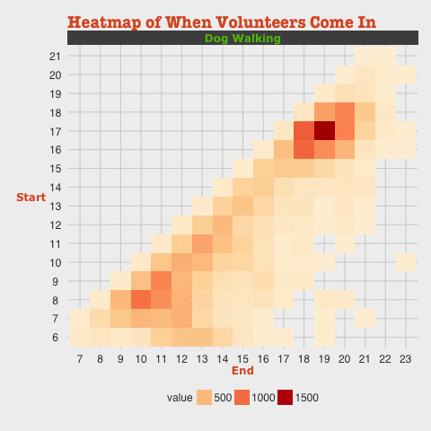
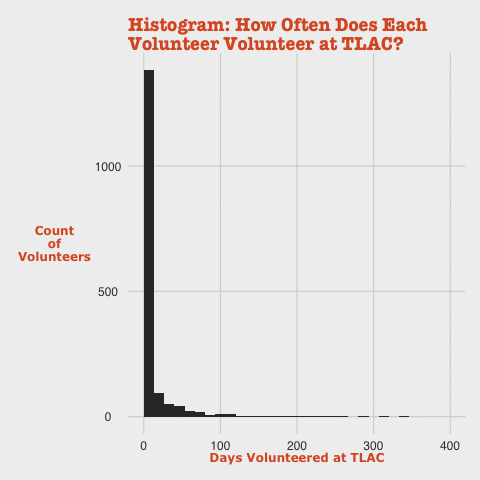
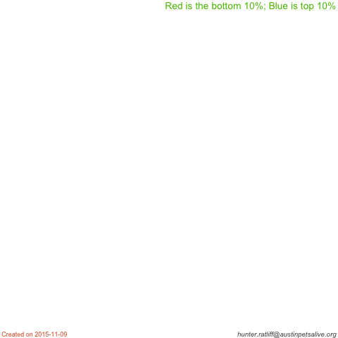

```{r global_options, include=FALSE}
require(knitr)

## Sets working directory to the "Austin Pets Alive" directory 
# setwd("~/Google Drive/100 - Publicly hosted/rootR/Austin Pets Alive")
opts_knit$set(root.dir = "..")

## Sets output for figures
knitr::opts_chunk$set(fig.width=12, fig.height=8, fig.path='../Figures/Dog Walking/',
                      echo=FALSE, warning=FALSE, message=FALSE, fig.align='center')

## Load citation functions
source("../../Citations/Citation-APA.R")
```


# General information

About   

The goal of this analysis is to explore data pulled from [Vol2](https://app.betterimpact.com/Login/Admin) (i.e. Better Impact or <http://MyVolunteerPage.com>) about the Dog Walkers at Austin Pets Alive's main campus, [Town Lake Animal Center](https://goo.gl/maps/zxc3AtzTifH2) (TLAC). 

```{r TLAC Map, fig.height=3, fig.width=3}
suppressPackageStartupMessages(require(ggmap))
suppressPackageStartupMessages(require(ggthemes))

ggmap(get_googlemap(center = c(-97.7598826,30.2696963), zoom=17, markers = as.data.frame(x = list(c(-97.7598826),c(30.2696963))))) + theme_map()
```

### Data set   

This data has been pulled from our database, and covers a time span from August 2015 to early November. This includes all activities with a `DatabaseActivityCategoryId` of `54883` (*Dog Program - TLAC*) with a primary focuses on two volunteer activities, *Dog Walking* and *RuffTail Runner* (`DatabaseActivityId`: `2261529` and `1719647`, respectively).

```
DatabaseActivityCategoryId: 
> IDs: 54883
Dates:
> Start: 2015-08-01
> End:   2015-11-06
```

### Purpose   

We've had some unusual weather patterns recently, as Austin has had more than it's fair share of bad weather days. I'm concerned that the poor weather has negatively influenced our volunteer engagement, particularly for activities that are outdoors like dog walking. I've also incidentally observed that the shelter lacks the same volunteer base during weekdays as we do on weekends, and it's really a few dedicated volunteers who regularly walk dogs during these less than desirable times. 

Therefore, the purpose of this analysis is to investigate these observations, and if my intuition is correct, identify explanatory variables for this disparity in engagement. Finally, I'd like to recognize the volunteers who remain dedicated to walking dogs, irregardless of the time of the week or the weather.

---


# Plots

```{r Set enviroment}
# setwd("~/Google Drive/100 - Publicly hosted/rootR/Austin Pets Alive")
suppressPackageStartupMessages(require(dplyr))
suppressPackageStartupMessages(require(lubridate))
suppressPackageStartupMessages(require(ggplot2))
suppressPackageStartupMessages(require(ggthemes))
suppressPackageStartupMessages(require(stringi))
suppressPackageStartupMessages(require(reshape2))
# suppressPackageStartupMessages(require(gridExtra))
suppressPackageStartupMessages(require(extrafont))
suppressPackageStartupMessages(require(extrafontdb))
```

```{r Import hours}
# Import all hours
Hours.all <- read.csv("Data/hours/Hours_2015-11-09.csv", na.strings="") %>%
  tbl_df() %>%
  mutate(
    Date     = as.Date(mdy_hms(DateVolunteered)),
    Start    = ymd_hm(paste(Date, ClockStartTime)),
    End      = ymd_hm(paste(Date, ClockEndTime)),
    Name     = paste(FirstName, LastName),
    Hours    = round(HoursWorked, 2)) %>% 
  filter(
    Date <= as.Date(today()),
    Date >= as.Date("2014-01-01"))

# Selected export of TLAC - Dog  hours
Hours <- Hours.all %>%
  filter(DatabaseActivityCategoryId==54883) %>%
  select(Date, Activity=ActivityName, Hours, Name, Start, End, 
         User.ID=DatabaseUserId, Type=EntryType)

# Factor IDs
Hours$User.ID <- as.factor(Hours$User.ID)
Hours$Name    <- as.factor(Hours$Name)

Hours$Activity <- as.character(Hours$Activity)
Hours$Activity[Hours$Activity=="Support (laundry, clean up, kongs)"] <- "Support"
Hours$Activity[grepl(pattern = "Dog Walking", Hours$Activity)]       <- "Dog Walking"
Hours$Activity <- as.factor(Hours$Activity)

# Preview data
# glimpse(Hours)
summary(Hours)
```

```{r Theme object}
APA.theme = theme_fivethirtyeight() + theme(
  axis.title = element_text(family="Verdana", color = "#DD5928", face = "bold"),
  plot.title = element_text(hjust = 0, size = rel(1.5), face = "bold", family="American Typewriter", color = "#DD5928"),
  strip.background = element_rect(fill="#4D4D4D"),
  strip.text = element_text(family="Verdana", color = "#5BC002", face = "bold")
)
```


-----


```{r Plot_01, eval=F}
Hours %>% 
  group_by(Date, Activity) %>%
  filter(Type=="Timeclock") %>%
  mutate(
    NumVols = n_distinct(User.ID), 
    median  = median(Hours),
    wk      = floor_date(Start, unit="week"),
    wkday   = weekdays(Start, abbreviate = T)
  )  %>%
  ggplot(aes(x=Start, y=NumVols, group=Activity)) + 
  geom_line() + 
  geom_point(aes(color=wkday)) + 
  facet_wrap("wk", scales = "free_x", ncol=3) + 
  APA.theme
citation.apa()
```

```{r Weather}
## Install the weatherData package ----
# library("devtools")
# suppressMessages(install_github("weatherData", "Ram-N"))
require(weatherData)

## Get weather ----
weather <- getSummarizedWeather("AUS", opt_all_columns = T,
                                start_date = "2014-11-06", end_date = "2015-11-06") %>%
  mutate(Date = as.Date(Date)) %>%
  select(Date, Events, Temp=Mean_TemperatureF, Vis=Mean_VisibilityMiles, 
         Wind=Mean_Wind_SpeedMPH, Prec=PrecipitationIn, Cloud=CloudCover) %>%
  tbl_df()

## Formatting ----
# Make precipitation vector numerical
weather$PrecNum <- as.numeric(weather$Prec)

# Events as vectors
weather$Fog          <- grepl(pattern = "Fog", weather$Events)
weather$Thunderstorm <- grepl(pattern = "Thunderstorm", weather$Events)
weather$Rain         <- grepl(pattern = "Rain", weather$Events)
weather$Events       <- ifelse(weather$Thunderstorm, "Thunderstorm", ifelse(weather$Rain, "Rain", "None"))


# Make events factors
weather$Events <- factor(weather$Events)


## Join to data ----
Hours.Weather <- inner_join(Hours, weather) %>%
  filter(
    Activity %in% c("RuffTail Runner", "Dog Walking"),
    Date > as.Date(ymd("2014-11-06"))) %>%
  # select(-Activity) %>%
  group_by(Activity, Date) %>% 
  mutate(
    NumVols = n_distinct(User.ID), 
    median  = median(Hours), 
    sum     = sum(Hours), 
    wk      = floor_date(Date, unit="week"),
    week.num= week(Date),
    wkday   = wday(Date, label = T, abbr = T)
  ) 

# Make weekday as factors
Hours.Weather$wkday <- factor(Hours.Weather$wkday, 
                   levels = c("Sun", "Mon", "Tues", "Wed", "Thurs", "Fri", "Sat"),
                   ordered = T)  
```

### Total Hours Logged   

This graphic is looking at the total number of hours logged (the numbers) in respect to the number of volunteers who logged hours (the red to green coloring). This only measures hours logged under Dog walking and Rufftail Runners (RTR) and is grouped by date.

It's broken down by day of the week on the x-axis, and the week on the y-axis. A blue number indicates that day had thunderstorms, a black number indicates rain, and a grey number indicates that there was no weather activities recorded.

```{r Fig01_Heatmap_SumHours&numVols-by-Date&weatherEvent}
Hours.Weather %>%
  filter(Date >= as.Date("2015-08-01")) %>%
  # Geoms
  ggplot(aes(x=wkday, y=wk)) + 
  geom_tile(aes(fill=NumVols)) + 
  geom_text(aes(
    label=paste(round(sum), ""),
    color=Events), family="Verdana") +
  # Scales
  scale_fill_continuous(name="Number of Volunteers", low="#FF8888", high="#66CC66") +
  scale_color_manual(values = c("None"="#7D7D7D", "Rain"="black", "Thunderstorm"="blue")) + 
  # Labels & Theme
  labs(x="Day of the week", y="Week", 
       title="Hours of Dog Walking Logged & \nNumber of Dog Walkers Over the Last 14 Weeks") +
  APA.theme
citation.apa()
```

---

### Number of Volunteers   
**Density**   
This plot is a density plot of the daily number of volunteers who walked dogs. It's broken down by three "weather events": Thunderstorm (dark blue), Rain (light blue), and no weather event (white). 

Note: There is significant crossover among groups, so there are some areas that may appear to be light blue, when it's actually just a crossover of white and dark blue.

```{r Fig02_Density_NumOfWalkers-by-WeatherEvent}
qplot(data=Hours.Weather, x=NumVols, fill=Events, geom="density", alpha=I(0.5)) + 
  scale_fill_manual(
    values = c("None"="#F7FBFD", "Rain"="#B2D5EE", "Thunderstorm"="#4485F5")) + 
  coord_flip() + APA.theme + labs(y="Density", x="Number of\nvolunteers\nwho walked\ndogs", 
                                  title="Number of Dog Walkers vs\nType of Weather") 
citation.apa()
```

***

**Boxplot**   
This plot is factored with a boxplot representing each weather event (using the same color scheme as before). Again, the the daily number of volunteers who walked dogs is represented on the y-axis. 

Plotted on top of the boxplot are points representing each day within that weather event-type. The points are further divided by shape representing the day of the week and color representing the "wetness" that day. 

"Wetness" is defined by the density ranking of the amount of precipitation for that day. Therefore

```{r Fig03_Boxplot_NumOfWalkers-by-WeatherEvent+weekday}
Hours.Weather %>%
  filter(!is.na(Events)) %>%
  # Geoms
  ggplot(aes(x=Events,y=NumVols)) + 
  geom_boxplot(aes(fill=Events)) + 
  geom_jitter(aes(shape=wkday, color=dense_rank(PrecNum))) + 
  geom_rug(sides = "l") + 
  # Scales
  scale_shape_manual(
    name="Weekday or weekend?", 
    values = c("Sun"=15, "Mon"=3, "Tue"=3, "Wed"=3, "Thu"=3, "Fri"=3, "Sat"=17)) + 
  scale_color_continuous(
    name="How wet was it?", 
    low="#66CC66", high="#FF4444") + 
  scale_fill_manual(
    values = c("None"="#F7FBFD", "Rain"="#B2D5EE", "Thunderstorm"="#4485F5")) + 
    guides(fill=F) +
  # Labels & Theme
  labs(x="Weather event", y="Number of\nvolunteers\nwho walked\ndogs", 
       title="Number of Dog Walkers vs\nType of Weather vs Day of the Week") +
  APA.theme
citation.apa()
```

***

**Violin**   
```{r Fig04_violin_NumOfWalkers-by-WeatherEvent+weekday}
Hours.Weather %>%
  filter(!is.na(Events)) %>%
  # Geoms
  ggplot(aes(x=Events,y=NumVols)) + 
  geom_violin(aes(fill=Events)) + 
  geom_jitter(aes(shape=wkday, color=dense_rank(PrecNum))) + 
  geom_rug(sides = "l") + 
  # Scales
  scale_shape_manual(
    name="Weekday or weekend?", 
    values = c("Sun"=15, "Mon"=3, "Tue"=3, "Wed"=3, "Thu"=3, "Fri"=3, "Sat"=17)) + 
  scale_color_continuous(
    name="How wet was it?", 
    low="#66CC66", high="#FF4444") + 
  scale_fill_manual(
    values = c("None"="#F7FBFD", "Rain"="#B2D5EE", "Thunderstorm"="#4485F5")) + 
    guides(fill=F) +
  # Labels & Theme
  labs(x="Weather event", y="Number of\nvolunteers\nwho walked\ndogs", 
       title="Number of Dog Walkers vs\nType of Weather vs Day of the Week") +
  APA.theme
citation.apa()
```

***

```{r Experimental}
# Create data.frame
df <- Hours %>%
  filter(Hours <= 14,                     # Because nobody walks dogs for 14+ hours
         Start < End | is.na(Start),      # If Start is after End, remove
         Activity %in% c("Dog Walking", "RuffTail Runner", "Kennel Tech", "Support")) %>%  
  mutate(
    Name     = as.character(Name),
    Interval = interval(Start, End)) %>%  # Use 'int_start' and 'int_end' to get times
  
  group_by(Date, Activity) %>% mutate(
    Hours.Day = sum(Hours),
    Vols.Day  = n_distinct(User.ID)) %>% ungroup() %>%
  
  group_by(User.ID, Activity, Name) %>% mutate(
    Hours.Vol = sum(Hours),
    Days.Vol  = n_distinct(Date)) %>% ungroup() %>%
  
  select(Date:Hours, Hours.Vol, Hours.Day, Vols.Day, Days.Vol, 
         User.ID, Type, Interval, Start, End, Name) # %>% glimpse()

## Change NA intervals to NA's
df$Interval[is.na(int_start(df$Interval))] <- NA 
  
# glimpse(df)

TopVols <- group_by(df, User.ID, Name) %>%
  summarise(Hours = sum(Hours), Days = n()) %>% 
  ungroup() %>% 
  # top_n(n = 50, wt = Days) %>% 
  arrange(desc(Days)) 

TopVols.hist <- qplot(data=TopVols, x=Days) + 
    labs(x="Days Volunteered at TLAC", y="Count\nof\nVolunteers", 
         title="Histogram: How Often Does Each\nVolunteer Volunteer at TLAC?") + APA.theme

df.TopVols <- semi_join(df, top_n(TopVols, n=16, wt=Days) %>% select(User.ID, Name)) %>%
  arrange(desc(Days.Vol)) %>%
  mutate(Interval = interval(Start, End))# %>%
```

### Heatmap of Start Time and End Time

```{r Fig05_Heatmap_StartTime+EndTime-by-SumHours}
# Plot
filter(df, Type!="Logged") %>% select(-Type) %>%
  mutate(Interval = interval(Start, End)) %>% #glimpse()
  ggplot(aes(x=factor(hour(int_end(Interval))), 
             y=factor(hour(int_start(Interval))), z=Hours)) + 
  stat_summary2d(fun=sum) +
  facet_wrap("Activity") +
  scale_fill_distiller(type = "seq", palette = 8) +
  # scale_alpha
  labs(y="Start", x="End", title="Heatmap of When Volunteers Come In") + APA.theme
citation.apa()
```


```{r Fig06, eval=F}
# Plot
filter(df.TopVols, Type!="Logged") %>% select(-Type) %>%
  mutate(Interval = interval(Start, End),
         h        = hour(int_start(Interval))) %>% #glimpse()
  ggplot(aes(x=factor(hour(int_end(Interval))), y=factor(hour(int_start(Interval))), z=Hours)) + 
  stat_summary2d(fun=sum) +
  # facet_wrap("Activity") +
  scale_fill_distiller(type = "seq", palette = 8) +
  # scale_alpha
  labs(y="Volunteer's\nName", x="Week", title="Heatmap of Top 16 Volunteers") + APA.theme
citation.apa()
```


### GIFs

```{r Fig07_GIF_Heatmap_StartTime+EndTime-by-SumHours, eval=F}
require(animation)
require(RColorBrewer)

# Plot
saveGIF(movie.name = "Fig07_GIF_Heatmap_StartTime+EndTime-by-SumHours.gif", interval=3, {
  for(i in c("Dog Walking", "Support", "Kennel Tech", "RuffTail Runner")) {
    
    G <- filter(df, Type!="Logged", Activity==i) %>% 
      mutate(Interval = interval(Start, End)) %>% 
      ggplot(aes(x=factor(hour(int_end(Interval))), 
                 y=factor(hour(int_start(Interval))), z=Hours)) + 
      stat_summary2d(fun=sum) +
      facet_wrap("Activity") +
      scale_fill_distiller(type = "seq", palette = 8) +
      # scale_alpha
      labs(y="Start", x="End", title="Heatmap of When Volunteers Come In") + APA.theme
    print(G)
  }
})
```



***

```{r Fig08_GIF_Histogram_TopVolunteers, eval=F}
require(animation)
require(RColorBrewer)

# Plot 
saveGIF(movie.name = "Fig08_GIF_Histogram_TopVolunteers.gif", {
    for (i in 0:5) print(TopVols.hist + xlim(c(0,400/2^i)))
})
```



***

```{r Fig09_GIF_BarChart_VolHours, eval=F}
require(animation)
require(RColorBrewer)

# Plot 
saveGIF(movie.name = "Fig09_GIF_BarChart_VolHours.gif", {
    for (i in 1:10) {
      g <- df %>%
        group_by(Activity) %>%
        # mutate(VolRank = ntile(Hours.Vol, 20)*0.05) %>%
        mutate(VolRank = percent_rank(Hours.Vol)) %>%
        ungroup() %>% arrange(desc(VolRank)) %>%
        filter(VolRank <= i*0.1) %>%
        
        ggplot(aes(x=Activity, y=Hours, group=VolRank, fill=round(VolRank, 1)), 
               color="black") +
        geom_bar(stat="identity") + 
        scale_fill_distiller(palette = "Spectral", limits=c(0,1)) +
        # scale_fill_gradientn(colours=topo.colors(10), breaks = c(1:10)*10) +
        ylim(c(0,35000)) + guides(fill=F) +
        labs(title="Hours contributed by percentile rank") +
        APA.theme
      
      citation.apa(text = "Red is the bottom 10%; Blue is top 10%")
      
      print(g)
    }
  }
)

#  
```




-----


# Statisitical models

**Disclaimer:** This section is still a work in progress!

```{r Build model data frame}
df.mat <- Hours.Weather %>%
  select(-Prec, -wk) %>%
  # glimpse() %>%
  arrange(Date) %>%
  mutate(Prec = ifelse(PrecNum==0,F,T))


```

## Number of Volunteers

### Linear Model
```{r NumVols models lm}
## Lets look at the number of volunteers who came in
#  Convert to week to account for variance among days of the week 
# qplot(data=Hours.Weather, NumVols)

NumVols.lm <- lm(NumVols ~ Prec + Wind + week(Date) + wkday,data = df.mat, weights = sum)
summary(NumVols.lm)
NumVols.lm.matrix <- model.matrix(NumVols.lm)
```


### General Linear Model
```{r NumVols models glm}
NumVols.glm <- glm(NumVols ~ Prec + Wind + week(Date) + wkday,data = df.mat, weights = sum)
summary(NumVols.glm)
NumVols.glm.matrix <- model.matrix(NumVols.glm)
```

***

## Sum of hours logged

### Linear Model
```{r sum models lm}
## Lets look at the total hours logged
#  Convert to week to account for variance among days of the week 
# qplot(data=Hours.Weather, sum)

sum.lm <- lm(sum ~ Wind + Prec + week(Date) + wkday, data = df.mat, weights = NumVols)
summary(sum.lm)
sum.lm.matrix <- model.matrix(sum.lm)
```

### General Linear Model

```{r sum models glm}
sum.glm <- glm(sum ~ Wind + Prec + week(Date) + wkday, data = df.mat, weights = NumVols)
summary(sum.glm)
sum.glm.matrix <- model.matrix(sum.glm)

```